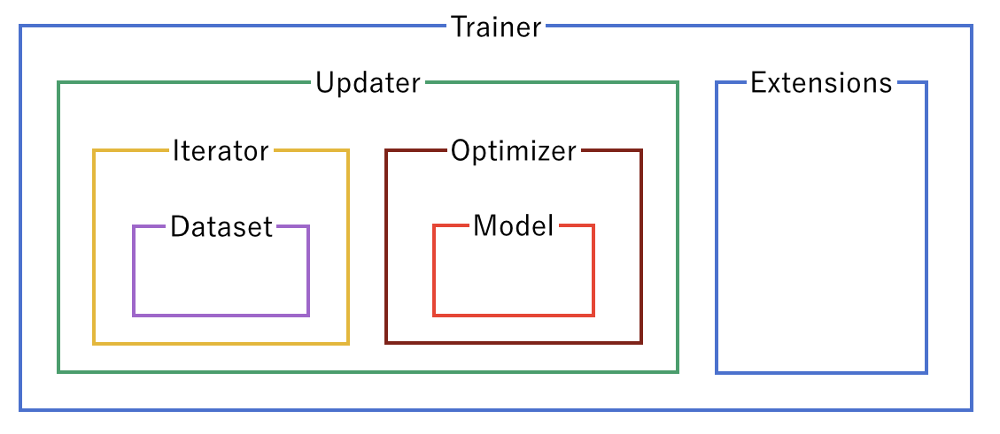

# 4. Prepare the Updater

[Trainer](https://docs.chainer.org/en/latest/reference/core/generated/chainer.training.Trainer.html#chainer.training.Trainer) is a class that holds all of the necessary components needed for training. The main components are shown below.

Basically, all you need to pass to [Trainer](https://docs.chainer.org/en/latest/reference/core/generated/chainer.training.Trainer.html#chainer.training.Trainer) is an [Updater](https://docs.chainer.org/en/latest/reference/core/generated/chainer.training.Updater.html#chainer.training.Updater). However, [Updater](https://docs.chainer.org/en/latest/reference/core/generated/chainer.training.Updater.html#chainer.training.Updater) contains an [Iterator](https://docs.chainer.org/en/latest/reference/core/generated/chainer.dataset.Iterator.html#chainer.dataset.Iterator) and [Optimizer](https://docs.chainer.org/en/latest/reference/core/generated/chainer.Optimizer.html#chainer.Optimizer). Since [Iterator](https://docs.chainer.org/en/latest/reference/core/generated/chainer.dataset.Iterator.html#chainer.dataset.Iterator) can access the dataset and [Optimizer](https://docs.chainer.org/en/latest/reference/core/generated/chainer.Optimizer.html#chainer.Optimizer) has references to the model, [Updater](https://docs.chainer.org/en/latest/reference/core/generated/chainer.training.Updater.html#chainer.training.Updater) can access to the model to update its parameters.

So, [Updater](https://docs.chainer.org/en/latest/reference/core/generated/chainer.training.Updater.html#chainer.training.Updater) can perform the training procedure as shown below:

Retrieve the data from dataset and construct a mini-batch ([Iterator](https://docs.chainer.org/en/latest/reference/core/generated/chainer.dataset.Iterator.html#chainer.dataset.Iterator))
Pass the mini-batch to the model and calculate the loss
Update the parameters of the model ([Optimizer](https://docs.chainer.org/en/latest/reference/core/generated/chainer.Optimizer.html#chainer.Optimizer))

Now let’s create the [Updater](https://docs.chainer.org/en/latest/reference/core/generated/chainer.training.Updater.html#chainer.training.Updater) object !

**Note**

Here, the model defined above is passed to [Classifier](https://docs.chainer.org/en/latest/reference/generated/chainer.links.Classifier.html#chainer.links.Classifier) and changed to a new [Chain](https://docs.chainer.org/en/latest/reference/core/generated/chainer.Chain.html#chainer.Chain). [Classifier](https://docs.chainer.org/en/latest/reference/generated/chainer.links.Classifier.html#chainer.links.Classifier), which in fact inherits from the [Chain](https://docs.chainer.org/en/latest/reference/core/generated/chainer.Chain.html#chainer.Chain) class, keeps the given [Chain](https://docs.chainer.org/en/latest/reference/core/generated/chainer.Chain.html#chainer.Chain) model in its `predictor` attribute. Once you give the input data and the corresponding class labels to the model by the `()` accessor,

1. [\_\_call\_\_()](https://docs.chainer.org/en/latest/reference/generated/chainer.links.Classifier.html#chainer.links.Classifier.__call__) of the model is invoked. The data is then given to `predictor` to obtain the output `y`.
2. Next, together with the given labels, the output `y` is passed to the loss function which is determined by `lossfun` argument in the constructor of [Classifier](https://docs.chainer.org/en/latest/reference/generated/chainer.links.Classifier.html#chainer.links.Classifier).
The loss is returned as a [Variable](https://docs.chainer.org/en/latest/reference/core/generated/chainer.Variable.html#chainer.Variable).

In [Classifiler](https://docs.chainer.org/en/latest/reference/generated/chainer.links.Classifier.html#chainer.links.Classifier), the `lossfun` is set to [softmax_cross_entropy()](https://docs.chainer.org/en/latest/reference/generated/chainer.functions.softmax_cross_entropy.html#chainer.functions.softmax_cross_entropy) as default.

[StandardUpdater](https://docs.chainer.org/en/latest/reference/core/generated/chainer.training.StandardUpdater.html#chainer.training.StandardUpdater) is the simplest class among several updaters. There are also the [ParallelUpdater](https://docs.chainer.org/en/latest/reference/core/generated/chainer.training.ParallelUpdater.html#chainer.training.ParallelUpdater) and the [MultiprocessParallelUpdater](https://docs.chainer.org/en/latest/reference/core/generated/chainer.training.updaters.MultiprocessParallelUpdater.html#chainer.training.updaters.MultiprocessParallelUpdater) to utilize multiple GPUs.
