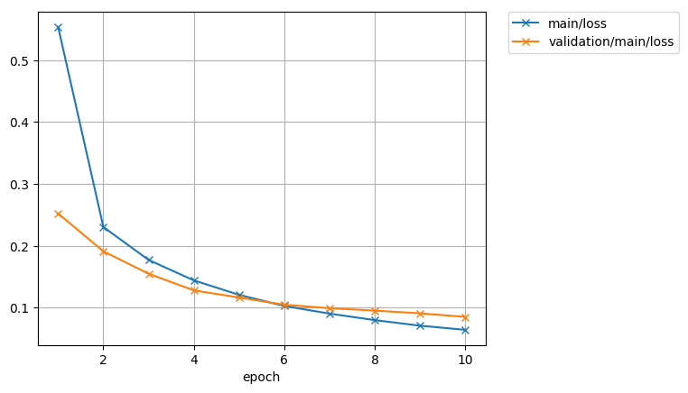
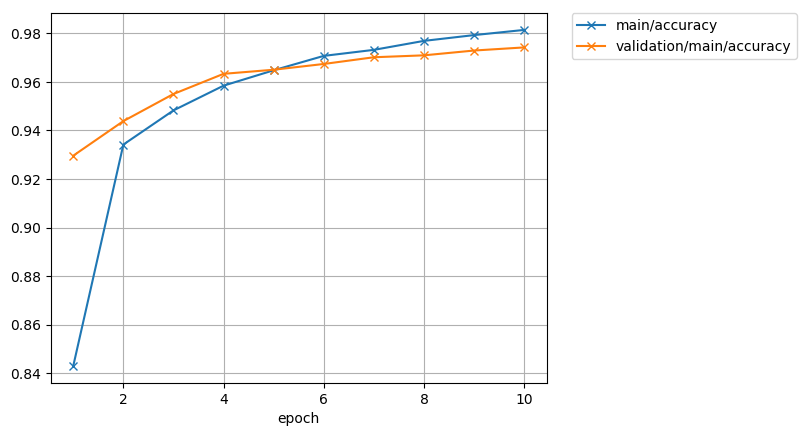
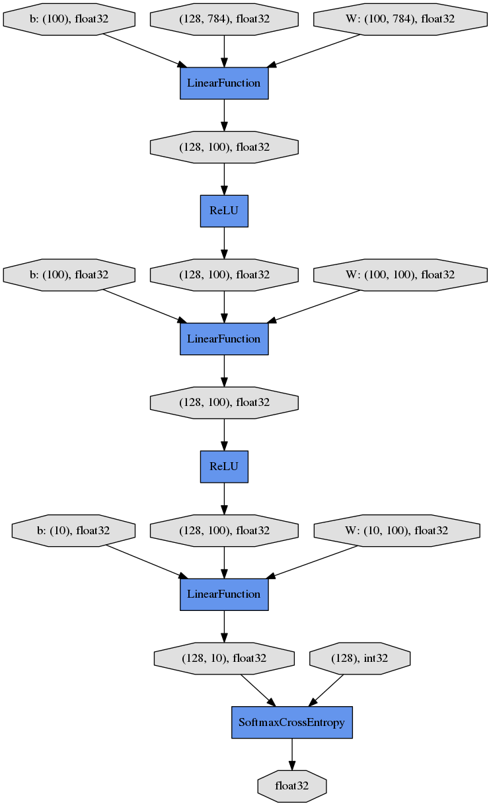

# 7. Start Training

Just call `run()` method from [Trainer](https://docs.chainer.org/en/latest/reference/core/generated/chainer.training.Trainer.html#chainer.training.Trainer) object to start training.

Let’s see the plot of loss progress saved in the mnist_result directory.



How about the accuracy?



Furthermore, let’s visualize the computaional graph saved with dump_graph() using Graphviz.

```bash
dot -Tpng mnist_result/cg.dot -o mnist_result/cg.png
```



From the top to the bottom, you can see the data flow in the computational graph. It basically shows how data and parameters are passed to the [Function](https://docs.chainer.org/en/latest/reference/core/generated/chainer.Function.html#chainer.Function)s.
