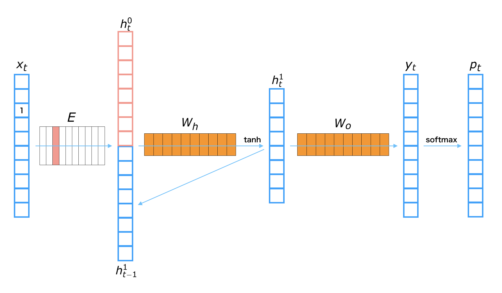

1. Basic Idea of Recurrent Neural Net Language Model
=====================================================

1.1 Recurrent Neural Net Language Model
---------------------------------------

**Recurrent Neurral Net Language Model** (RNNLM) is a type of neural net language models which contains RNNs in the network. Since an RNN can deal with the variable length inputs, it is suitable for modeling sequential data such as sentences in natural language.

We show one layer of a RNNLM with these parameters.

| Symbol | Definition |
|-------:|:-----------|
| ${\bf x}_t$ | the one-hot vector of $t$-th word |
| ${\bf y}_t$ | the $t$-th output |
| ${\bf h}_t^{(i)}$ | the $t$-th hidden layer of $i$-th layer |
| ${\bf p}_t$ | the next word's probability of $t$-th word |
| ${\bf E}$ | Embedding matrix |
| ${\bf W}_h$ | Hidden layer matrix |
| ${\bf W}_o$ | Output layer matrix |

**The process to get a next word prediction from $t$-th input word ${\bf x}_t$**

1. Get the embedding vector: ${\bf h}_t^{(0)} = {\bf E} {\bf x}_t$
2. Calculate the hidden layer: ${\bf h}_t^{(1)} = {\rm tanh}\left({\bf W}_h \left[ \begin{array}{cc} {\bf h}_t^{(0)} \\ {\bf h}_{t-1}^{(1)} \end{array} \right]\right)$
3. Calculate the output layer: ${\bf y}_t = {\bf W}_o {\bf h}_t^{(1)}$
4. Transform to probability: ${\bf p}_t = {\rm softmax}({\bf y}_t)$

- Note that ${\rm tanh}$ in the above equation is applied to the input vector in element-wise manner.
- Note that $\left[ \begin{array}{cc} {\bf a} \\ {\bf b} \end{array} \right]$ denotes a concatenated vector of ${\bf a}$ and ${\bf b}$.
- Note that ${\rm softmax}$ in the above equation converts an arbitrary real vector to a probability vector which the summation over all elements is $1$.
