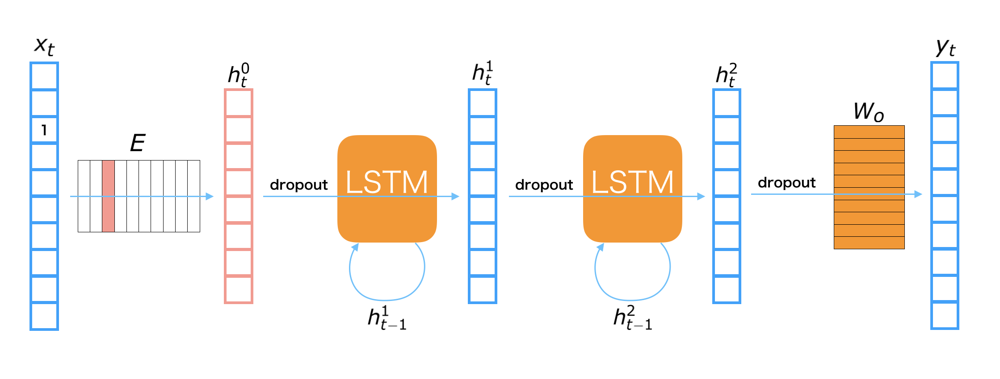

2. Implementation of Recurrent Neural Net Language Model
=========================================================

**There is an example of RNN language model in the official repository, so we will explain how to implement a RNNLM in Chainer based on that: [chainer/examples/ptb](https://github.com/chainer/chainer/tree/master/examples/ptb)**

2.1 Model overview
-----------------

The RNNLM used in this notebook is depicted in the above figure. The symbols appeared in the figure are defined as follows:

| Symbol | Definition |
|-------:|:-----------|
| ${\bf x}_t$ | the one-hot vector of $t$-th input |
| ${\bf y}_t$ | the $t$-th output |
| ${\bf h}_t^{(i)}$ | the $t$-th hidden vector of $i$-th layer |
| ${\bf E}$ | Embedding matrix |
| ${\bf W}_o$ | Output layer matrix |

**LSTMs** (long short-term memory) are used for the connection of hidden layers. A LSTM is one of major recurrent neural net modules. It is desined for remembering the long-term memory, so that it should be able to consider relationships of distant words, such that a word at beginning of sentence and it at the end. We also use **Dropout** before both LSTMs and linear transformations. Dropout is one of regularization techniques for preventing overfitting on training dataset.
